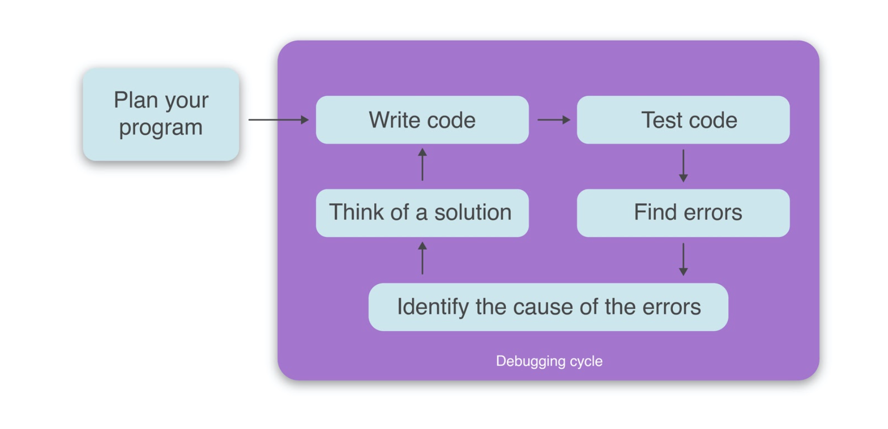

# Debugging 

 
## What is Debugging?
\
Debugging is the process of finding and fixing errors or bugs in the source code of any software. When software does not work as expected, computer programmers study the code to determine why any errors occurred.

The main **objective** of Debugging is to find the exact root cause at code level to fix the errors and bugs found during the testing.

\
**Flowchart of basic Debugging:**

Always debug the program for the simplest input that produces the bug. Solving a bug in the simplest case brings you closer to solving it in the general case; to solve a problem, solve a simpler sub-problem.

A bug fix should always be accompanied by a unit test. This guarantees that future bugs won't be caused by this bug and that you won't have to waste time fixing the same bug again.

To file a bug, give a list of steps that reliably cause the bug, and state the difference in expected and actual outcomes. Use the simplest input possible by starting with an input that causes the problem and simplifying it until it can't be simplified without the problem going away.

### Steps involved in debugging are:

- Problem identification and report preparation.
- Assigning the report to the software engineer defect to verify that it is genuine.
- Defect Analysis using modeling, documentation, finding and testing candidate flaws, etc.
- Defect Resolution by making required changes to the system.
- Validation of corrections.

### There are several common methods and techniques used in debugging, including:

- **Code Inspection:** This involves manually reviewing the source code of a software system to identify potential bugs or errors.

- **Debugging Tools:** There are various tools available for debugging such as debuggers, trace tools, and profilers that can be used to identify and resolve bugs.

- **Unit Testing:** This involves testing individual units or components of a software system to identify bugs or errors.

- **Integration Testing:** This involves testing the interactions between different components of a software system to identify bugs or errors.

- **System Testing:** This involves testing the entire software system to identify bugs or errors.

- **Monitoring:** This involves monitoring a software system for unusual behavior or performance issues that can indicate the presence of bugs or errors.

- **Logging:** This involves recording events and messages related to the software system, which can be used to identify bugs or errors.

### Production debugging

Production debugging is the process of finding bugs and errors within an application during its production environment and determining the cause of the error.

Production debugging poses various challenges, such as having to troubleshoot the app and disturbing its performance. Moreover, making changes to the program while it is running might lead to unanticipated outcomes for users and interfere with their overall user experience.
