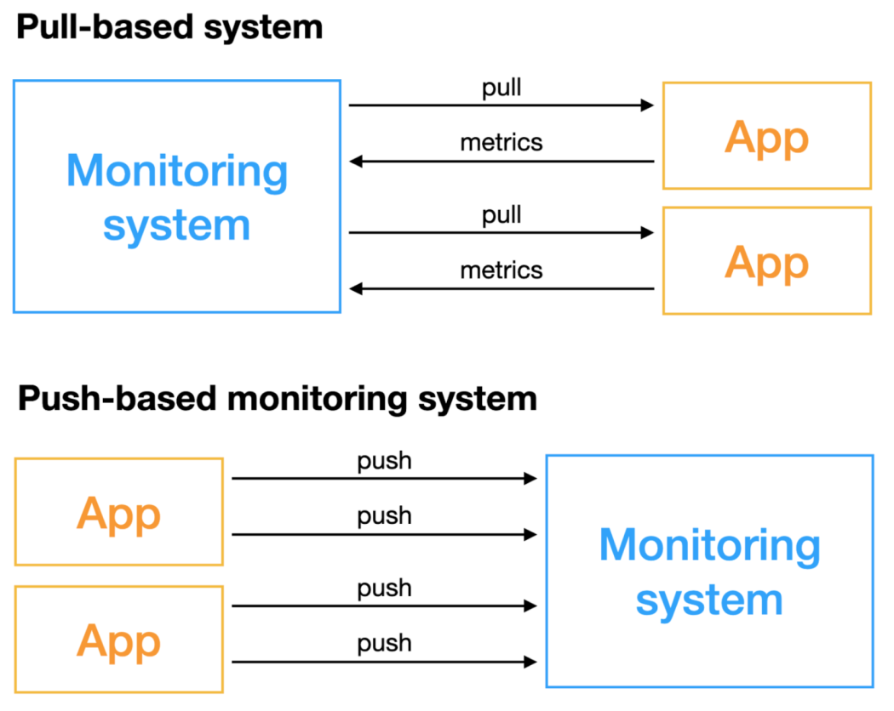

## Pull-based

- As the name implies, is a monitoring system that actively obtains indicators, and the objects that require monitoring need to have the capability to be accessed remotely.

## Push-based

- monitoring systems do not actively obtain data, but the monitored objects actively push indicators.

There are differences between the two methods in many aspects. For the construction and selection of monitoring systems, we must understand the advantages and disadvantages of these two methods in advance and choose the appropriate scheme for implementation. Otherwise, the subsequent maintenance cost of ensuring the stability of the monitoring system and the cost of deployment and O&M will be huge.

### Advantages of Pull-based monitoring over Push-based monitoring

- There is less overhead on the part of the application component servers, because the agents are only responsible for converting metrics to a format and making them accessible. They don't need to be able to send data somewhere else.
- This approach is less affected by network issues.
- Letting the monitoring server choose when to pull metrics means there is a lower (and configurable) likelihood of network congestion.
- We can create more than one monitoring server to spread the load of pulling metrics.
- Pull-based monitoring also allows server uptime to be monitored. In push-based monitoring, if a monitoring server does not send metrics, it could be due to network issues or many other potential problems. In a pull-based system, not being able to retrieve metrics is a more reliable way to determine whether the component is not responding.